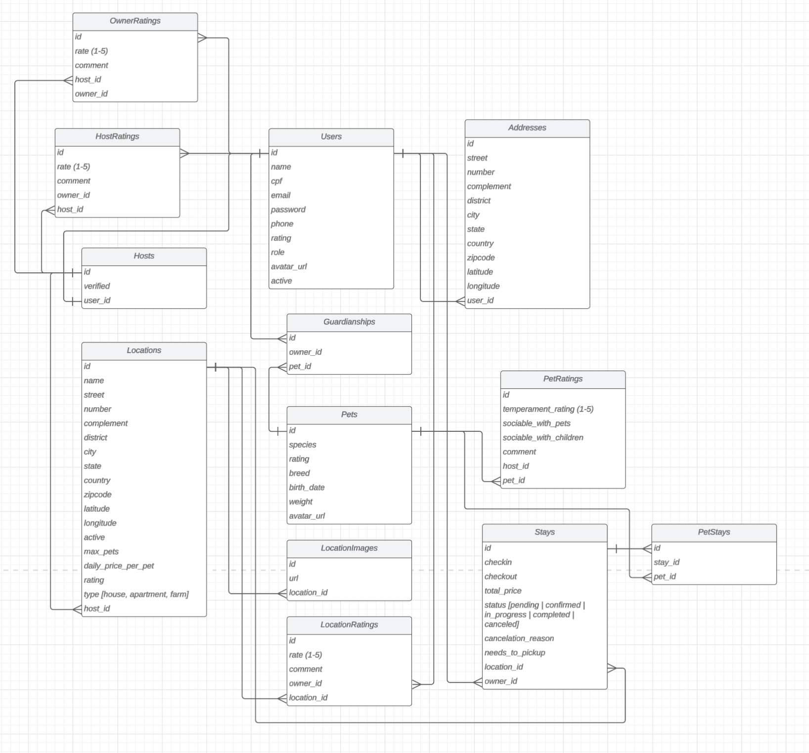

<h1 align="center">
  
</h1>

A pet-friendly hosting platform connecting pet owners with trusted hosts in a
homely environment.

## About The Project

AuConchegante is a platform that facilitates connections between pet owners
needing temporary accommodation for their pets and hosts offering a
family-friendly, welcoming environment.

### Key Features

- 🔐 Secure Authentication (JWT + OAuth2)
- 📍 Host Geolocation
- 💬 Real-time Chat
- 📅 Booking System
- 💳 Integrated Payments
- ⭐ Rating System
- 📧 Email Notifications
- 📲 Push Notifications (for auconchegante-app)

Check detailed backlog in [Stories](STORIES.md) file.

## Tech Stack

### Backend

```yaml
Core:
  - Java 21
  - Spring Boot 3.x
  - Spring Security
  - Spring Data JPA
  - Spring WebSocket

Database:
  - PostgreSQL
  - Redis (caching)
  - MongoDB (messaging)

Cloud:
  - AWS S3 (image storage)
  - AWS EC2

Messaging:
  - Apache Kafka

Documentation:
  - OpenAPI
```

### Entity Relationship Diagram



### Architecture

This project have Java and Node services. Java is used for the main services, like Authentication, Booking
and Payment. While Node is used for secondary services, such as Notification. All services are built
with Clean Architecture or Hexagonal Architecture.

PS.: I am using a monorepo only because it is a personal project to practice back-end skill. Soon a
client-side will consume this API, probably a Flutter app.

- Ports and Adapters Architecture / Clean Architecture
- Domain-Driven Design
- REST APIs
- WebSocket

## Prerequisites

- Java 21+
- Docker
- Maven
- PostgreSQL
- Redis

## Getting Started

### 1. Clone the repository

```bash
git clone https://github.com/almeida154/auconchegante-api.git
```

### 2. Navigate to directory

```bash
cd auconchegante-api
```

### 3. Start database

```bash
docker-compose up -d db
```

### 4. Run migrations (once) [here](./java-services/common/README.md)

### 5. Start individual services like [Auth](./java-services/auth/README.md) or run all of them at once

```bash
sh scripts/run-all-services.sh
```

## Stories

There is an organization about the things to do in this project. It's separate by service or general tasks.

- [General tasks](STORIES.md)
- [Auth service tasks](./java-services/auth/STORIES.md)

## Commit Standards

```
feat: new feature
fix: bug fix
docs: documentation
style: formatting
refactor: code refactoring
test: testing
chore: maintenance

For example:
feat(auth): add jwt authentication
```

---

With ❤️ by [David](https://github.com/almeida154) - davidalmeida154of@gmail.com
